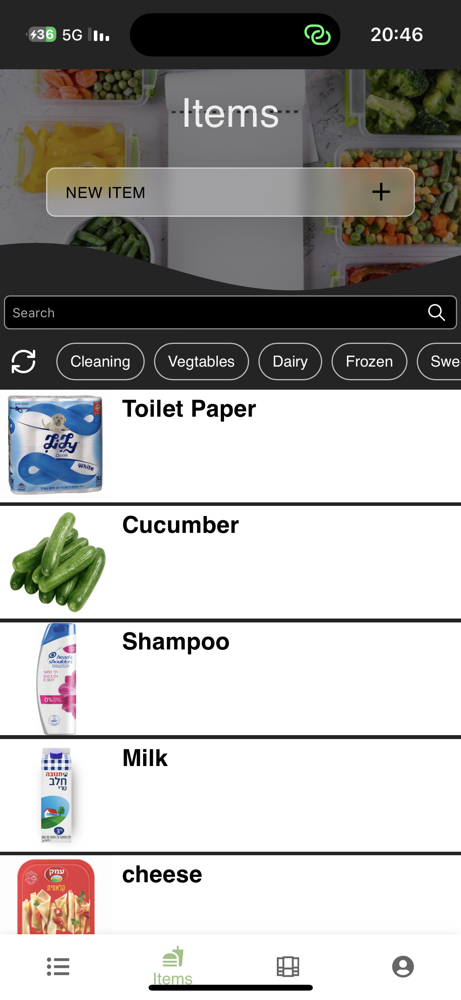
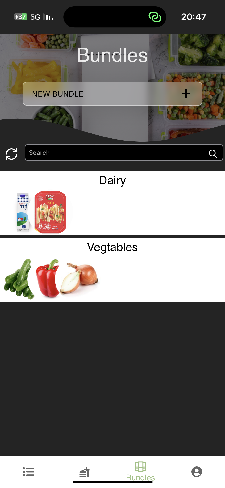
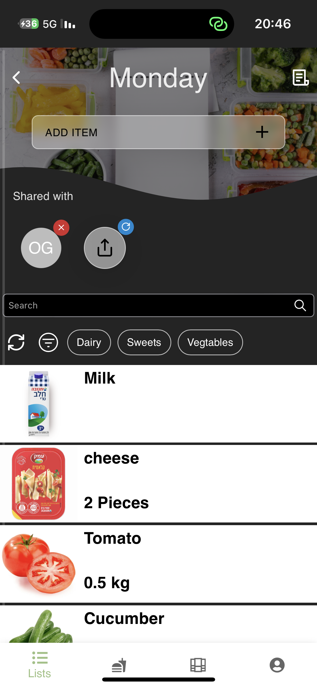

# Super Cart

Super Cart is a full stack application developed with React and Express, both written in TypeScript. This application helps users to organize and share shopping lists with ease.

## Features

- **Authentication and Google Authentication**: Secure login system with traditional email/password and Google OAuth.
- **Saving Items**: Save items with a name, description, and an optional amount and unit.
- **Bundle Items**: Quickly add groups of items to a list.
- **Sharing Items and Bundles**: Share individual items or bundles with other users.
- **Collaborative Lists**: Share lists with other users to edit together.

## Usage

1. Register or login using email/password or Google authentication.
2. Create a new shopping list.
3. Add items to your list with optional amount and unit details.
4. Create item bundles to quickly add multiple items at once.
5. Share items, bundles, or entire lists with other users.
6. Collaborate on lists with shared editing functionality.

## Technologies Used

- **Frontend**: React, TypeScript, Vite
- **State Management**: Recoil
- **Backend**: Express, TypeScript
- **Database**: MongoDB
- **Authentication**: JWT, Google OAuth
- **Image Uploads**: Cloudinary
- **Email Service**: NodeMailer

## Screenshots

### Mobile Views

<p align="center">
  
  
  
</p>

## Installation

### Prerequisites

- Node.js
- npm or yarn
- MongoDB

### Frontend Setup

1. Clone the repository:
    ```sh
    git clone https://github.com/yourusername/grocery-list.git
    cd grocery-list/client
    ```

2. Install dependencies:
    ```sh
    npm install
    ```

3. Create a `.env` file in the `client` directory and add the following environment variables:
    ```env
    VITE_API_URL=your_backend_api_url
    VITE_HOST_URL=your_frontend_host_url
    VITE_GOOGLE_CLIENT_ID=your_google_client_id
    ```

4. Start the development server:
    ```sh
    npm run dev
    ```

### Backend Setup

1. Navigate to the backend directory:
    ```sh
    cd ../server
    ```

2. Install dependencies:
    ```sh
    npm install
    ```

3. Create a `.env` file in the `server` directory and add the following environment variables:
    ```env
    PORT=your_port
    JWT_SECRET=your_jwt_secret
    MONGO_URI=your_mongodb_uri
    HOST_ADDRESS=your_host_address
    CLOUDINARY_CLOUD_NAME=your_cloudinary_cloud_name
    CLOUDINARY_API_KEY=your_cloudinary_api_key
    CLOUDINARY_API_SECRET=your_cloudinary_api_secret
    EMAIL_USERNAME=your_email_username
    EMAIL_SERVICE=your_email_service
    EMAIL_ADDRESS=your_email_address
    EMAIL_PASSWORD=your_email_password
    NODE_ENV=development_or_production
    GOOGLE_CLIENT_ID=your_google_client_id
    GOOGLE_CLIENT_SECRET=your_google_client_secret
    CLOUDINARY_BASE_FOLDER=your_cloudinary_base_folder
    ```

4. Start the development server:
    ```sh
    npm run dev
    ```

## Contributing

Contributions are welcome! Please fork the repository and submit a pull request for review.

## License

This project is licensed under the MIT License.